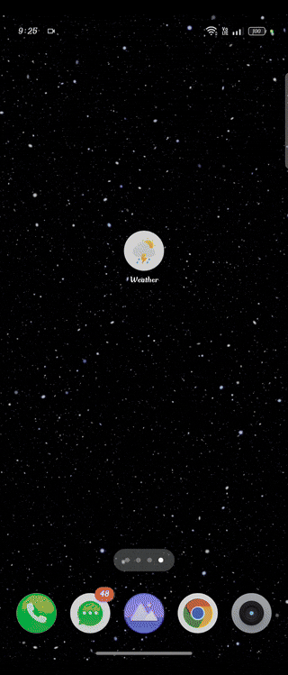
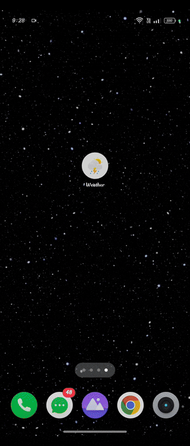
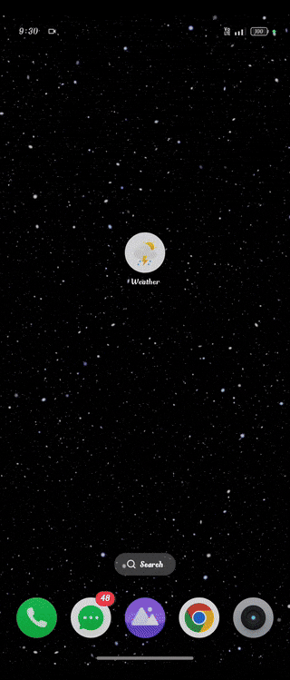
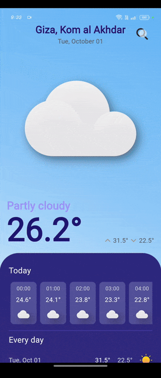

# Flutter Weather App

This project is a **sample Flutter Weather application** that integrates **Cubit for state management** and uses APIs to retrieve weather data and search for locations. The app provides real-time weather updates based on device location, along with automatic search functionality for other cities. It also handles location permissions, internet connectivity status, and dynamic animations between screens.

## Figma Design

You can view the design of this application on [Figma](https://www.figma.com/design/pX85ctgfBLGbKntNZiuvgU/UIFresh-weather-app-ui?node-id=0-1&t=Tf5gr5kWeh3xJRCs-1).

## Features

- **Weather by Device Location**: Automatically fetches the weather for the current device location using the [Weather API](https://www.weatherapi.com/).
- **Location Search**: Users can search for weather updates for specific cities using the [Photon API](https://photon.komoot.io).
- **State Management**: The app uses **Cubit** from the flutter_bloc package for efficient state management across different views.
- **Permissions Handling**: Automatic checks and prompts for location permissions when necessary.
- **Connectivity Awareness**: Auto-refreshes weather data when the app regains internet connection.
- **Animations**: Includes animated transitions between splash and home views for a smooth user experience.

## Demo

### Get Weather by Device Location


### Open Settings for Location Permission


### Auto-refresh when Internet is Restored


### Auto Search for Location


## Project Structure

The project is organized into a modular structure, separating the UI components, Cubits, and API service logic for scalability and maintainability.

### Cubits Used

- **WeatherCubit**: Handles weather data retrieval based on the device location and search queries.
- **LocationCubit**: Manages location searches and suggestions, and handles location permission states.

## Key Widgets

### `SplashView`

The **SplashView** displays the app logo and initializes the app by fetching the weather based on the user's device location. It also handles transitions to the **HomeView** with a fade animation.

```dart
class SplashView extends StatefulWidget {
  @override
  State<SplashView> createState() => _SplashViewState();
}

class _SplashViewState extends State<SplashView> {
  @override
  void initState() {
    super.initState();
    _navigateToHome();
  }

  void _navigateToHome() async {
    await BlocProvider.of<WeatherCubit>(context).getWeatherByDeviceLocation();
    Navigator.pushReplacement(
      context,
      PageRouteBuilder(
        pageBuilder: (_, __, ___) => const HomeView(),
        transitionDuration: const Duration(milliseconds: 1200),
        transitionsBuilder: (_, a, __, c) =>
            FadeTransition(opacity: a, child: c),
      ),
    );
  }

  @override
  Widget build(BuildContext context) {
    return Scaffold(
      backgroundColor: const Color(0xff211772),
      body: Center(
        child: SvgPicture.asset('assets/images/weather_logo.svg'),
      ),
    );
  }
}
```

### `HomeView`

The **HomeView** is the main screen where users can see the current weather or encounter prompts for permissions. It dynamically switches between different views based on the state of the weather data and permissions.

```dart
class HomeView extends StatelessWidget {
  @override
  Widget build(BuildContext context) {
    return BlocBuilder<WeatherCubit, WeatherState>(
      builder: (context, state) {
        return Scaffold(
          body: AnimatedSwitcher(
            duration: const Duration(milliseconds: 400),
            child: getHomeView(state),
          ),
        );
      },
    );
  }

  StatelessWidget getHomeView(WeatherState state) {
    if (state is NoLocationPermission) {
      return const LocationPermissionView();
    } else if (state is WeatherLoading) {
      return const LoadingView();
    } else if (state is WeatherLoaded) {
      return const WeatherDetailView();
    } else {
      return ErrorView(message: (state as WeatherError).message);
    }
  }
}
```

### `SearchView`

The **SearchView** allows users to search for new locations and provides suggestions as they type, using the Photon API for location queries.

```dart
class SearchView extends StatelessWidget {
  @override
  Widget build(BuildContext context) {
    final locationCubit = context.read<LocationCubit>();

    return Scaffold(
      body: Column(
        children: [
          CustomAppBar(),
          CustomSearchField(
            onChanged: (value) {
              locationCubit.getAutoSearchLocation();
            },
          ),
          SearchResults(),
        ],
      ),
    );
  }
}
```

## Packages Used

- **flutter_bloc**: For state management.
- **dio**: For making API requests.
- **connectivity_plus**: To check internet connectivity status.
- **intl**: For date and time formatting.
- **flutter_spinkit**: For loading animations.
- **flutter_svg**: For displaying SVG images.
- **geolocator**: To get the device's location.
- **liquid_pull_to_refresh**: For pull-to-refresh functionality.
- **simple_shadow**: To add shadows to widgets.
- **flutter_launcher_icons**: To generate app icons.

## Getting Started

### Prerequisites

- [Flutter SDK](https://flutter.dev/docs/get-started/install)
- A code editor like [VS Code](https://code.visualstudio.com/) or [Android Studio](https://developer.android.com/studio)

### Installation

1. **Clone the repository**:
   ```bash
   git clone https://github.com/AdhamElagaty/sample_weather_app.git
   cd sample_weather_app
   ```

2. **Install dependencies**:
   ```bash
   flutter pub get
   ```

3. **Run the app**:
   ```bash
   flutter run
   ```

---
